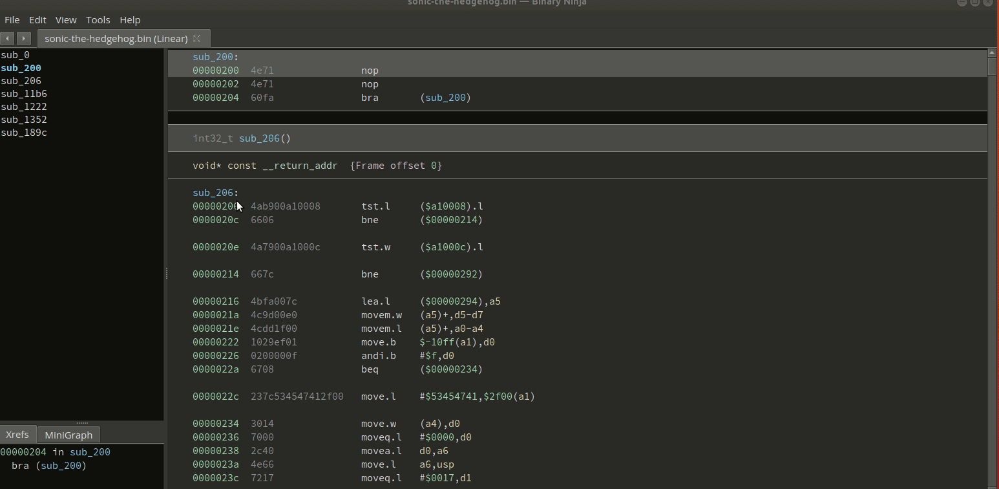

# bn-genesis

## Description

Suite of Binary Ninja plugins that assist with SEGA Genesis ROM hacking
* Load SEGA Genesis/Megadrive ROM's
    * Use .bin format roms. These are essentially raw memory dumps, data matches what you see in Genesis debugger
    * The other popular Genesis ROM format is SMD (Super Mega Drive). These have the data interleaved (probably
      some artifact of hardware limitations of the device that dumped the ROMs).  But this format sucks for
      reverse engineering or ROM hacking, so convert them to .bin
* Write m68k assembly and quickly apply a patch at a specified offset
* Fixup ROM checksums
* Enumerate call tables (deprecated)
    * Vector35 addressed issues with its core and now tables are recognized by auto-analysis 

## Dependencies

* Assembler plugin requires `gcc-m68k-linux-gnu` (Ubuntu or Debian)
* Loader requires the third party m68k processor module, which can be found [here](https://github.com/wrigjl/binaryninja-m68k)

## Directions

If you have the dependencies installed, you can just load a Genesis ROM.  If your ROM is successfully loaded you will
have an additional item in the dropdown above the code listing that is normally just RAW (it will say Sega Genesis / Megadrive ROM),
and you should have additional segments and sections that are specific to the Genesis.

# Genesis Hacking

## Emulators / Debuggers

* [BlastEm](https://www.retrodev.com/blastem/): Genesis emulator with built in
  debugger. Page says it has GDB remote debugging support, I haven't tried that
  yet, but I have used the built in debugger.  Also has VDP introspection UI and
  debuggers.
* [Gens KMod](https://segaretro.org/Gens_KMod): Modified version of Gens
  emulator that supports some has some advance VDP and CPU introspection UIs.

## Useful sites / tutorials

* [Nameless Algorithm Blog](https://namelessalgorithm.com/genesis/): Has some
  really well written explanations of how to write code for the Genesis, and
  great explanations on how the VDP works
* [Chibi Akumas](https://www.chibiakumas.com/): Has a large site with assembly
  tutorials for many retro consoles and computers.  From generic non-system
  specific info about different CPUs, to platform specific tutorials.  Also
  has Youtube videos / explanations to go along with each of the lessons.
* [Genesis / MegaDrive Technical Overview](https://segaretro.org/images/1/18/GenesisTechnicalOverview.pdf):
  Very technical details about how the Genesis works.  Not easy to digest,
  but very thorough and complete.
* [MegaDrive Wiki](https://md.railgun.works/index.php?title=Main_Page): Lots
  of info here, nice concise [VDP Reference](https://md.railgun.works/index.php?title=VDP).